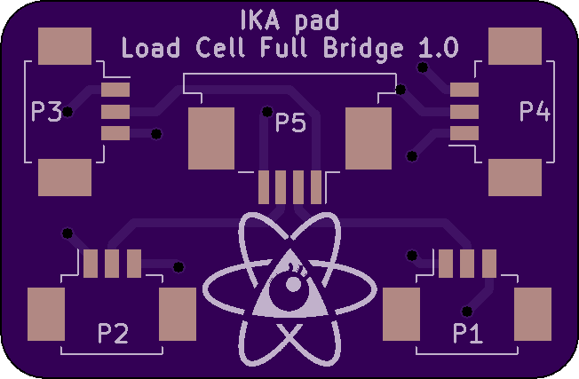
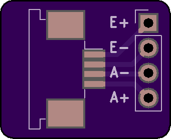

# ikapad
Electronics for a homemade DDR pad.

Uses four load cells per button configured in a full bridge measured by a HX711
amplifier and interfaced with a maple mini clone.

## Load Cell Full Bridge

Shared on [OSH Park.](https://oshpark.com/shared_projects/TjpPaXwd)

### BOM

| Name           | Description                 | MPN        |
|----------------|-----------------------------|------------|
| P1, P2, P3, P4 | MOLEX PICOBLADE 3POS 1.25MM | 0532610371 |
| P5             | TE CONN FPC 4POS 1.00MM     | 84952-4    |

## Amplifier Connector

Shared on [OSH Park.](https://oshpark.com/shared_projects/CgzNqpg0)

### BOM

| Name           | Description                 | MPN        |
|----------------|-----------------------------|------------|
| P1             | TE CONN FPC 4POS 1.00MM     | 84952-4    |

## Controller Half Shield

Shared on [OSH Park.](https://oshpark.com/shared_projects/OMPG9A2k)

### BOM

| Name           | Description          |
|----------------|----------------------|
| A1, A2, A3, A4 | HX711 BREAKOUT BOARD |
| A5             | BAITE MAPLE MINI     |
